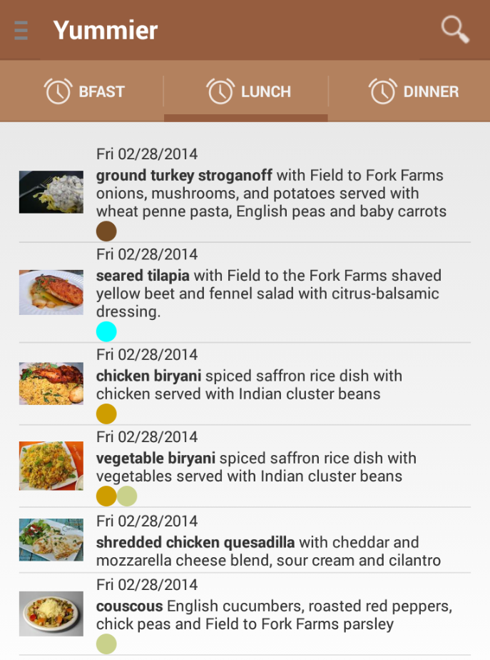
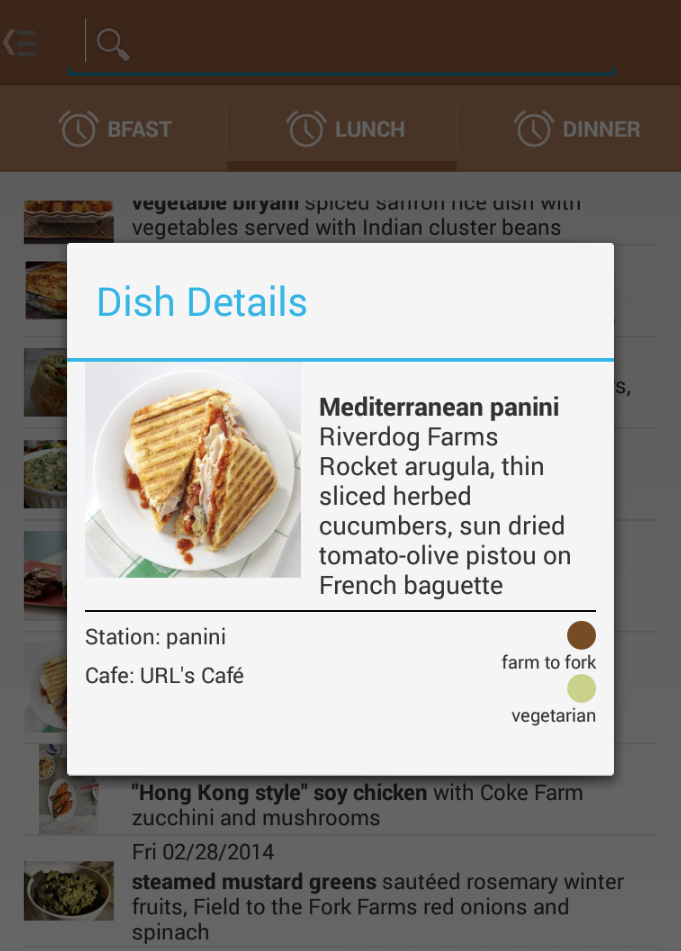
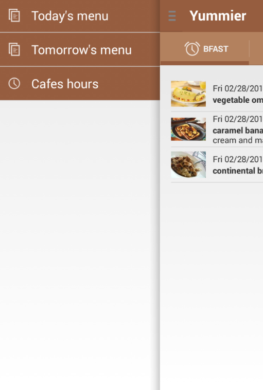

Yummier
=======

Description
-----------
Spending too much time staring at the menu in order to figure our what's up for lunch? Debating whether or not making the trip from one café to the other to get food will be worth it? Looking for a specific dish among the plenty of specials that are featured on our main campus every week?

With Yummier you can now relax and spend more time enjoying your food than looking for it!. 
Yummier let you spot – in seconds and on the go – the food you like and never miss the dishes you love! 

Yummier aggregates and augments the menu information and make it easier for you to search using various filters including café location, specific diet, type of dishes and even type of station.

Cédric Lignier

Screenshots
-----------

